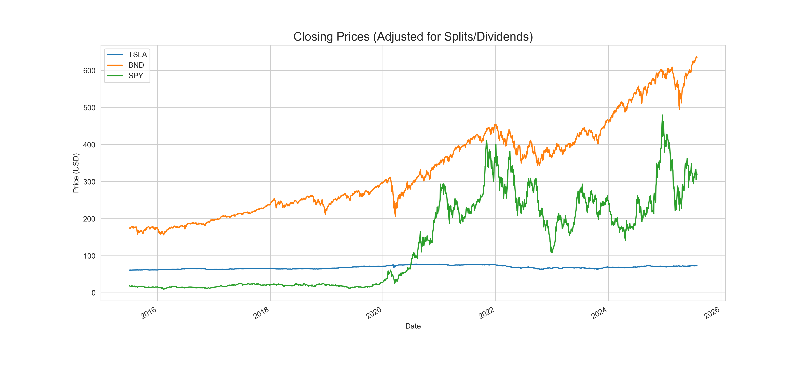
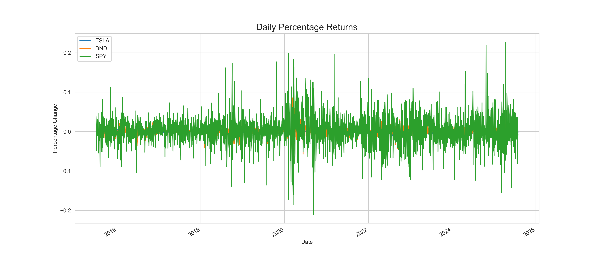
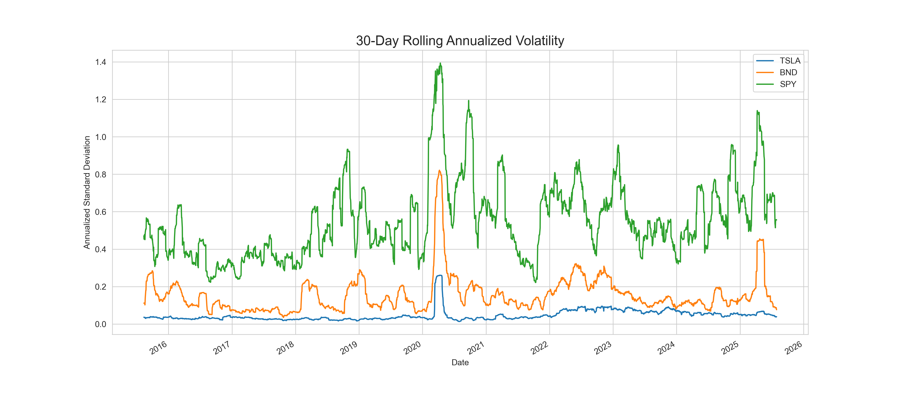

# Quantitative Portfolio Strategy: Time Series Forecasting & MPT Optimization

## Business Objective
This project was developed for the "Guide Me in Finance (GMF) Investments" case study. It leverages time series forecasting and Modern Portfolio Theory (MPT) to build and evaluate an optimized investment portfolio. The primary goal is to enhance portfolio performance by forecasting trends for a high-growth asset (Tesla - TSLA) and balancing it with stable assets (Vanguard Total Bond Market ETF - BND) and a market-representative ETF (S&P 500 ETF - SPY) to maximize risk-adjusted returns.

This repository serves as a comprehensive demonstration of a data-driven, end-to-end financial analysis workflow, from data ingestion and cleaning to modeling, optimization, and backtesting.

---

## Table of Contents
1. [Project Workflow](#project-workflow)
2. [Task 1: Data Ingestion & Exploratory Data Analysis](#task-1-data-ingestion--exploratory-data-analysis)
3. [Key Findings from Task 1](#key-findings-from-task-1)
4. [Project Structure](#project-structure)
5. [Technologies & Libraries Used](#technologies--libraries-used)
6. [How to Run This Project](#how-to-run-this-project)

---

## Project Workflow
The project follows a structured, multi-stage process:

1.  **Data Ingestion & EDA:** Fetch, clean, and explore historical financial data for TSLA, BND, and SPY.
2.  **Time Series Modeling:** Develop and compare ARIMA and LSTM models to forecast future prices for the volatile asset (TSLA).
3.  **Portfolio Optimization:** Use the forecast outputs and historical data to construct an optimal portfolio using Modern Portfolio Theory (MPT).
4.  **Strategy Backtesting:** Simulate the performance of the optimized portfolio against a benchmark to validate the strategy.

---

## Task 1: Data Ingestion & Exploratory Data Analysis
*(This section covers the work completed so far.)*

### 1.1. Data Extraction
-   **Source:** Yahoo! Finance API.
-   **Tool:** `yfinance` Python library.
-   **Assets:** Tesla (TSLA), Vanguard Total Bond Market ETF (BND), S&P 500 ETF (SPY).
-   **Period:** July 1, 2015 - July 31, 2025.
-   **Data Points:** Daily Open, High, Low, Close (adjusted), and Volume.

### 1.2. Data Preprocessing
-   Handled minimal missing values using linear interpolation to maintain the time series integrity.
-   Confirmed that the `yfinance` library's default behavior provides dividend and split-adjusted `Close` prices, which were used for all subsequent analysis.

### 1.3. Exploratory Data Analysis (EDA)
Performed a comprehensive EDA to understand the characteristics of each asset:

| Asset | Closing Price Trend | Daily Returns Volatility | Role in Portfolio |
| :---- | :--- | :--- | :--- |
| **TSLA** | High, exponential growth | Very High | High-growth, high-risk |
| **SPY** | Steady, upward trend | Moderate | Diversified market exposure |
| **BND** | Relatively stable/flat | Very Low | Stability and risk mitigation |

#### Key Visualizations
*(These figures are stored in the `reports/figures` directory)*

1.  **Closing Prices (Adjusted):** Visually confirms the growth trajectory and volatility of each asset.
    

2.  **Daily Percentage Returns:** Highlights the significant volatility of TSLA compared to the more stable SPY and BND.
    

3.  **30-Day Rolling Volatility:** Quantifies the dynamic risk profile over time, showing periods of calm and turbulence (e.g., the COVID-19 shock in 2020).
    


---

## Key Findings from Task 1
1.  **Stationarity:** The Augmented Dickey-Fuller (ADF) test confirmed that:
    *   TSLA's closing price series is **non-stationary** (`p-value > 0.05`), which is typical for trending asset prices. This necessitates differencing for ARIMA modeling.
    *   TSLA's daily returns series is **stationary** (`p-value < 0.05`), making it a suitable input for volatility analysis and a target for models that require stationarity.

2.  **Risk Metrics:**
    *   **Value at Risk (VaR 95%):** TSLA has a daily VaR of **-5.47%**, indicating a significantly higher downside risk compared to SPY (-1.72%) and BND (-0.49%).
    *   **Sharpe Ratio:** TSLA has the highest Sharpe Ratio (**0.74**), suggesting its historical returns have compensated well for its high risk. SPY has a solid ratio (0.68), while BND's is near zero, as expected for a stability-focused asset.

---

## Project Structure
The repository is organized to ensure clarity, reproducibility, and maintainability.

```

Quantitative-Portfolio-Strategy/
├── .github/workflows/ # CI/CD pipeline for automated testing
├── data/
│ ├── processed/ # Cleaned data (e.g., close_prices.csv)
│ └── raw/ # Raw data (if saved)
├── notebooks/ # Jupyter Notebooks for exploration & analysis
├── reports/
│ ├── figures/ # Saved plots and charts from analysis
│ └── GMF_Investment_Memo.pdf # Final professional report (to be added)
├── src/ # Modular, reusable Python source code
├── tests/ # Unit tests for the source code
├── .gitignore # Specifies files to be ignored by Git
├── LICENSE # Project license
├── README.md # You are here!
└── requirements.txt # Project dependencies
```


---

## Technologies & Libraries Used
-   **Data Analysis & Manipulation:** `pandas`, `numpy`
-   **Data Sourcing:** `yfinance`
-   **Time Series Analysis:** `statsmodels`, `pmdarima`
-   **Deep Learning:** `tensorflow` (for LSTM model)
-   **Portfolio Optimization:** `PyPortfolioOpt`
-   **Visualization:** `matplotlib`, `seaborn`
-   **Development:** `jupyterlab`, `python 3.9+`

---

## How to Run This Project
1.  **Clone the repository:**
    ```bash
    git clone https://github.com/your-username/Quantitative-Portfolio-Strategy.git
    cd Quantitative-Portfolio-Strategy
    ```

2.  **Create and activate a virtual environment:**
    ```bash
    # Create the environment
    python -m venv venv

    # Activate it (on Windows)
    venv\Scripts\activate

    # Activate it (on macOS/Linux)
    source venv/bin/activate
    ```

3.  **Install the required dependencies:**
    ```bash
    pip install -r requirements.txt
    ```

4.  **Explore the analysis:**
    -   Open the Jupyter Notebooks in the `notebooks/` directory to follow the step-by-step analysis. Start with `01_data_extraction_and_eda.ipynb`.
    -   All processed data and figures generated by the notebooks will be saved in the `data/processed` and `reports/figures` directories, respectively.

    ---

## Task 2: Time Series Forecasting Models
To predict future prices for the high-volatility asset (TSLA), two distinct modeling approaches were developed and evaluated: a classical statistical model (ARIMA) and a deep learning model (LSTM).

### 2.1. Data Splitting
The dataset was split chronologically to simulate a real-world forecasting scenario:
-   **Training Set:** Data from July 1, 2015, to December 31, 2023.
-   **Test Set:** Data from January 1, 2024, to July 31, 2025.

### 2.2. Model Development
1.  **ARIMA (AutoRegressive Integrated Moving Average):**
    -   `pmdarima.auto_arima` was used to automatically determine the optimal model parameters (p, d, q).
    -   The best model identified was a simple `ARIMA(0, 1, 0)`, also known as a random walk model. This model captures the overall trend but not the nuanced volatility.

2.  **LSTM (Long Short-Term Memory):**
    -   A deep learning model was constructed using TensorFlow/Keras.
    -   The model architecture consisted of two LSTM layers with dropout for regularization, followed by two dense layers.
    -   Data was scaled using `MinMaxScaler` and structured into sequences of 60 historical time steps to predict the next day's price.

### 2.3. Model Performance & Comparison
The models were evaluated on the test set using Mean Absolute Error (MAE), Root Mean Squared Error (RMSE), and Mean Absolute Percentage Error (MAPE).

| Metric | ARIMA Model | **LSTM Model** |
| :--- | :--- | :--- |
| MAE | 63.72 | **14.86** |
| RMSE | 79.03 | **19.84** |
| MAPE | 24.16% | **5.45%** |

#### Key Visualizations
*(LSTM forecast shows superior tracking of actual price movements)*


### Conclusion from Task 2
The **LSTM model significantly outperformed the ARIMA model** across all evaluation metrics. Its ability to learn complex, non-linear patterns from the historical data allowed it to capture the volatility and price movements of TSLA with much greater accuracy. Therefore, the LSTM model's forecasts will be used as the primary input for the portfolio optimization stage in Task 3.