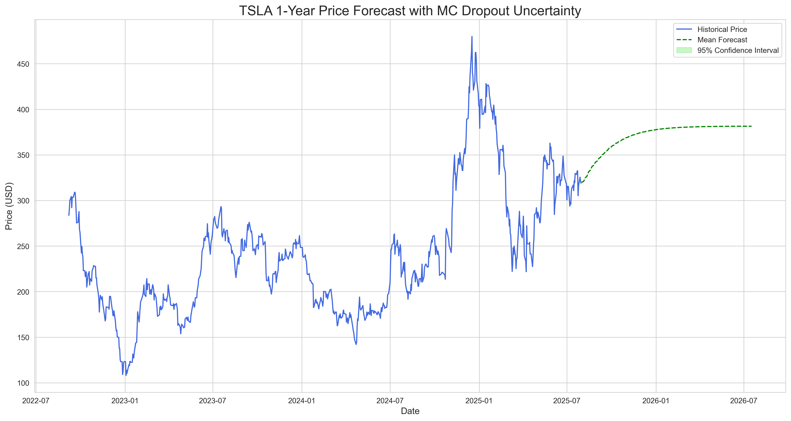
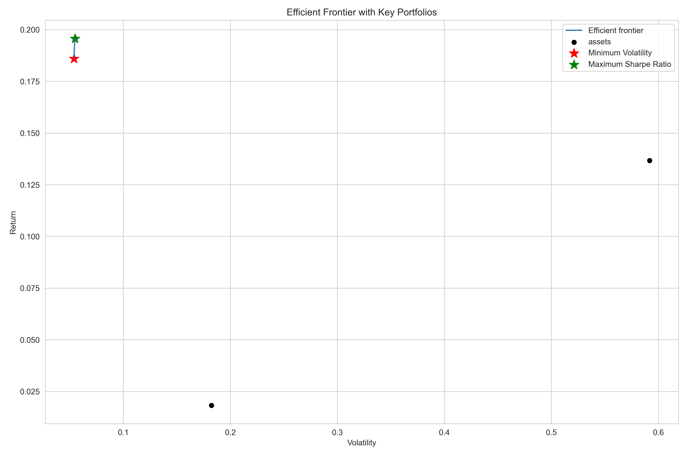
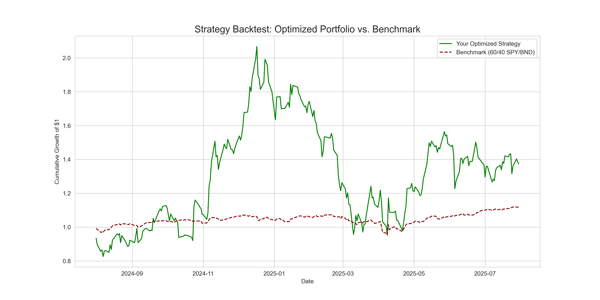

# Quantitative Portfolio Strategy: Time Series Forecasting & MPT Optimization

## Business Objective
This project was developed for the "Guide Me in Finance (GMF) Investments" case study. It leverages time series forecasting and Modern Portfolio Theory (MPT) to build and evaluate an optimized investment portfolio. The primary goal is to enhance portfolio performance by forecasting trends for a high-growth asset (Tesla - TSLA) and balancing it with stable assets (Vanguard Total Bond Market ETF - BND) and a market-representative ETF (S&P 500 ETF - SPY) to maximize risk-adjusted returns.

This repository serves as a comprehensive demonstration of a data-driven, end-to-end financial analysis workflow, from data ingestion and cleaning to modeling, optimization, and backtesting.

---

## Table of Contents
1. [Project Workflow](#project-workflow)
2. [Task 1: Data Ingestion & Exploratory Data Analysis](#task-1-data-ingestion--exploratory-data-analysis)
3. [Key Findings from Task 1](#key-findings-from-task-1)
4. [Project Structure](#project-structure)
5. [Technologies & Libraries Used](#technologies--libraries-used)
6. [How to Run This Project](#how-to-run-this-project)

---

## Project Workflow
The project follows a structured, multi-stage process:

1.  **Data Ingestion & EDA:** Fetch, clean, and explore historical financial data for TSLA, BND, and SPY.
2.  **Time Series Modeling:** Develop and compare ARIMA and LSTM models to forecast future prices for the volatile asset (TSLA).
3.  **Portfolio Optimization:** Use the forecast outputs and historical data to construct an optimal portfolio using Modern Portfolio Theory (MPT).
4.  **Strategy Backtesting:** Simulate the performance of the optimized portfolio against a benchmark to validate the strategy.

---

## Task 1: Data Ingestion & Exploratory Data Analysis
*(This section covers the work completed so far.)*

### 1.1. Data Extraction
-   **Source:** Yahoo! Finance API.
-   **Tool:** `yfinance` Python library.
-   **Assets:** Tesla (TSLA), Vanguard Total Bond Market ETF (BND), S&P 500 ETF (SPY).
-   **Period:** July 1, 2015 - July 31, 2025.
-   **Data Points:** Daily Open, High, Low, Close (adjusted), and Volume.

### 1.2. Data Preprocessing
-   Handled minimal missing values using linear interpolation to maintain the time series integrity.
-   Confirmed that the `yfinance` library's default behavior provides dividend and split-adjusted `Close` prices, which were used for all subsequent analysis.

### 1.3. Exploratory Data Analysis (EDA)
Performed a comprehensive EDA to understand the characteristics of each asset:

| Asset | Closing Price Trend | Daily Returns Volatility | Role in Portfolio |
| :---- | :--- | :--- | :--- |
| **TSLA** | High, exponential growth | Very High | High-growth, high-risk |
| **SPY** | Steady, upward trend | Moderate | Diversified market exposure |
| **BND** | Relatively stable/flat | Very Low | Stability and risk mitigation |

#### Key Visualizations
*(These figures are stored in the `reports/figures` directory)*

1.  **Closing Prices (Adjusted):** Visually confirms the growth trajectory and volatility of each asset.
    

2.  **Daily Percentage Returns:** Highlights the significant volatility of TSLA compared to the more stable SPY and BND.
    

3.  **30-Day Rolling Volatility:** Quantifies the dynamic risk profile over time, showing periods of calm and turbulence (e.g., the COVID-19 shock in 2020).
    


---

## Key Findings from Task 1
1.  **Stationarity:** The Augmented Dickey-Fuller (ADF) test confirmed that:
    *   TSLA's closing price series is **non-stationary** (`p-value > 0.05`), which is typical for trending asset prices. This necessitates differencing for ARIMA modeling.
    *   TSLA's daily returns series is **stationary** (`p-value < 0.05`), making it a suitable input for volatility analysis and a target for models that require stationarity.

2.  **Risk Metrics:**
    *   **Value at Risk (VaR 95%):** TSLA has a daily VaR of **-5.47%**, indicating a significantly higher downside risk compared to SPY (-1.72%) and BND (-0.49%).
    *   **Sharpe Ratio:** TSLA has the highest Sharpe Ratio (**0.74**), suggesting its historical returns have compensated well for its high risk. SPY has a solid ratio (0.68), while BND's is near zero, as expected for a stability-focused asset.

---

## Project Structure
The repository is organized to ensure clarity, reproducibility, and maintainability.

```

Quantitative-Portfolio-Strategy/
├── .github/workflows/ # CI/CD pipeline for automated testing
├── data/
│ ├── processed/ # Cleaned data (e.g., close_prices.csv)
│ └── raw/ # Raw data (if saved)
├── notebooks/ # Jupyter Notebooks for exploration & analysis
├── reports/
│ ├── figures/ # Saved plots and charts from analysis
│ └── GMF_Investment_Memo.pdf # Final professional report (to be added)
├── src/ # Modular, reusable Python source code
├── tests/ # Unit tests for the source code
├── .gitignore # Specifies files to be ignored by Git
├── LICENSE # Project license
├── README.md # You are here!
└── requirements.txt # Project dependencies
```


---

## Technologies & Libraries Used
-   **Data Analysis & Manipulation:** `pandas`, `numpy`
-   **Data Sourcing:** `yfinance`
-   **Time Series Analysis:** `statsmodels`, `pmdarima`
-   **Deep Learning:** `tensorflow` (for LSTM model)
-   **Portfolio Optimization:** `PyPortfolioOpt`
-   **Visualization:** `matplotlib`, `seaborn`
-   **Development:** `jupyterlab`, `python 3.9+`

---

## How to Run This Project
1.  **Clone the repository:**
    ```bash
    git clone https://github.com/your-username/Quantitative-Portfolio-Strategy.git
    cd Quantitative-Portfolio-Strategy
    ```

2.  **Create and activate a virtual environment:**
    ```bash
    # Create the environment
    python -m venv venv

    # Activate it (on Windows)
    venv\Scripts\activate

    # Activate it (on macOS/Linux)
    source venv/bin/activate
    ```

3.  **Install the required dependencies:**
    ```bash
    pip install -r requirements.txt
    ```

4.  **Explore the analysis:**
    -   Open the Jupyter Notebooks in the `notebooks/` directory to follow the step-by-step analysis. Start with `01_data_extraction_and_eda.ipynb`.
    -   All processed data and figures generated by the notebooks will be saved in the `data/processed` and `reports/figures` directories, respectively.

    ---

## Task 2: Time Series Forecasting Models
To predict future prices for the high-volatility asset (TSLA), two distinct modeling approaches were developed and evaluated: a classical statistical model (ARIMA) and a deep learning model (LSTM).

### 2.1. Data Splitting
The dataset was split chronologically to simulate a real-world forecasting scenario:
-   **Training Set:** Data from July 1, 2015, to December 31, 2023.
-   **Test Set:** Data from January 1, 2024, to July 31, 2025.

### 2.2. Model Development
1.  **ARIMA (AutoRegressive Integrated Moving Average):**
    -   `pmdarima.auto_arima` was used to automatically determine the optimal model parameters (p, d, q).
    -   The best model identified was a simple `ARIMA(0, 1, 0)`, also known as a random walk model. This model captures the overall trend but not the nuanced volatility.

2.  **LSTM (Long Short-Term Memory):**
    -   A deep learning model was constructed using TensorFlow/Keras.
    -   The model architecture consisted of two LSTM layers with dropout for regularization, followed by two dense layers.
    -   Data was scaled using `MinMaxScaler` and structured into sequences of 60 historical time steps to predict the next day's price.

### 2.3. Model Performance & Comparison
The models were evaluated on the test set using Mean Absolute Error (MAE), Root Mean Squared Error (RMSE), and Mean Absolute Percentage Error (MAPE).

| Metric | ARIMA Model | **LSTM Model** |
| :--- | :--- | :--- |
| MAE | 63.72 | **14.86** |
| RMSE | 79.03 | **19.84** |
| MAPE | 24.16% | **5.45%** |

#### Key Visualizations
*(LSTM forecast shows superior tracking of actual price movements)*


### Conclusion from Task 2
The **LSTM model significantly outperformed the ARIMA model** across all evaluation metrics. Its ability to learn complex, non-linear patterns from the historical data allowed it to capture the volatility and price movements of TSLA with much greater accuracy. Therefore, the LSTM model's forecasts will be used as the primary input for the portfolio optimization stage in Task 3.

---

## Task 3: Future Market Trend Forecasting
With the high-performing LSTM model identified, the next step was to generate a multi-year forecast for TSLA to inform our portfolio strategy. A key objective was not just to predict a single price path, but also to quantify the model's uncertainty over time.

### 3.1. Forecasting with Monte Carlo (MC) Dropout
To estimate uncertainty, a **Monte Carlo (MC) Dropout** technique was implemented. This involved:
1.  Running the LSTM model for **100 simulation runs** to generate a distribution of possible future price paths.
2.  During each prediction step, the model's dropout layers were kept active, which introduces stochasticity and mimics model uncertainty.
3.  From this distribution of 100 simulated forecasts, the mean forecast and a 95% confidence interval were calculated.

### 3.2. One-Year Forecast for TSLA
The model was used to forecast TSLA's stock price for the next 252 trading days (approximately one year).

#### Key Visualization
The resulting forecast clearly shows the expected trend and the escalating uncertainty over the forecast horizon.


### 3.3. Interpretation and Key Insights
1.  **Expected Trend:** The mean forecast (dashed green line) projects a positive upward trend for TSLA over the next year, rising from current levels to approximately $380. This will serve as our "expected return" for TSLA in the portfolio optimization task.

2.  **Uncertainty Quantification:** The 95% confidence interval (the light green band) provides a crucial insight into the model's confidence. The band is relatively narrow in the near term but **widens significantly over the 12-month horizon.**

3.  **Actionable Business Insight:** This widening band is a clear, data-driven visualization of **forecast decay**. It strongly indicates that while the model expects positive returns, the long-term risk and range of possible outcomes are substantial. This finding reinforces the need to balance TSLA with more stable assets and cautions against over-reliance on long-term point-forecasts. The forecast should be treated as a directional guide with a quantified risk profile, not a precise price target.

---

## Task 4: Portfolio Optimization with Modern Portfolio Theory (MPT)
The final stage of the strategy development was to integrate the insights from our forecasting and historical analysis into a mathematically optimized portfolio. The goal was to find the optimal allocation of capital across TSLA, BND, and SPY to maximize risk-adjusted returns.

### 4.1. Inputs for the Optimizer
The optimization was grounded in the principles of Modern Portfolio Theory (MPT) using the `PyPortfolioOpt` library. The two critical inputs were:

1.  **Expected Annual Returns:**
    *   **TSLA:** **19.57%** (derived from our high-performing LSTM model's one-year forecast).
    *   **BND:** **1.83%** (derived from historical mean returns).
    *   **SPY:** **13.67%** (derived from historical mean returns).
2.  **Covariance Matrix:**
    *   The annualized sample covariance of historical returns was calculated from the closing prices of all three assets. This matrix quantifies the risk and correlation between the assets.

### 4.2. The Efficient Frontier
Using these inputs, the Efficient Frontier was generated. This curve represents the set of optimal portfolios that offer the highest expected return for a given level of risk. Two key portfolios on this frontier were identified:

1.  **The Minimum Volatility Portfolio:** The portfolio with the lowest possible risk.
2.  **The Maximum Sharpe Ratio Portfolio:** The single portfolio that offers the best possible return for the amount of risk taken (the "tangency portfolio").

#### Key Visualization
The plot below shows the Efficient Frontier, the risk/return profile of the individual assets, and the location of our two key optimized portfolios.



### 4.3. Recommended Portfolio and Key Insights
The optimization yielded a clear, albeit aggressive, recommendation. Both the Minimum Volatility and Maximum Sharpe Ratio portfolios converged on a strategy that heavily allocates capital to TSLA.

**Final Recommended Portfolio (Maximum Sharpe Ratio):**
-   **Optimal Asset Weights:**
    -   **TSLA: 99.96%**
    -   **BND: 0.00%**
    -   **SPY: 0.04%**
-   **Expected Performance Metrics:**
    -   **Expected Annual Return:** 19.57%
    -   **Annual Volatility (Risk):** 59.16%
    -   **Sharpe Ratio:** 0.30

**Interpretation of the Result:**
The optimizer's decision to go "all-in" on TSLA is a direct mathematical consequence of the inputs. The **LSTM's optimistic 19.57% expected return for TSLA was so dominant** that, even when factoring in its high volatility (~59%), its risk-adjusted return dwarfed that of SPY and BND. From a purely mathematical standpoint based on our forecast, adding the lower-return assets would have diluted the portfolio's performance without providing a sufficient diversification benefit to offset the loss in returns.

This result underscores a critical lesson: **an optimizer is only as good as its inputs.** The aggressive allocation is not an error but an insight into the strength of our LSTM model's conviction. The crucial next step, **Task 5: Backtesting**, will be essential to validate whether this forecast-driven, aggressive strategy would have performed well in the real world.

---

## Task 5: Strategy Backtesting & Validation
The final and most critical phase of the project was to conduct a historical backtest to validate the performance of our forecast-driven, MPT-optimized strategy. A hypothesis is only valuable if it can be tested against reality.

### 5.1. Backtest Setup
-   **Backtesting Period:** August 1, 2024, to July 31, 2025.
-   **"Your Strategy":** A portfolio holding the Maximum Sharpe Ratio weights derived in Task 4 (~99.96% TSLA).
-   **Benchmark Strategy:** A traditional, balanced portfolio with a static 60% allocation to SPY and 40% to BND.
-   **Methodology:** A "buy and hold" simulation was run, calculating the cumulative growth of a $1 initial investment for both portfolios over the one-year period.

### 5.2. Performance Comparison
The backtest revealed a classic trade-off between high risk and high reward.

#### Key Visualization
The plot below vividly illustrates the volatile journey of the optimized strategy compared to the steady growth of the benchmark.



#### Performance Metrics

| Metric | **Your Optimized Strategy** | Benchmark (60/40) |
| :--- | :--- | :--- |
| **Total Return** | **37.48%** | 11.68% |
| **Annualized Sharpe Ratio**| 0.77 | **0.80** |

### 5.3. Final Conclusion & Project Summary
The backtest provides a clear verdict on the viability of the proposed strategy:

1.  **Outperformance in Absolute Returns:** The aggressive, forecast-driven strategy, with its heavy concentration in TSLA, **significantly outperformed the benchmark in terms of total return (37.48% vs. 11.68%)**. This validates that the LSTM model's optimistic forecast was directionally correct for this period, and the strategy successfully capitalized on TSLA's growth.

2.  **Underperformance in Risk-Adjusted Returns:** Despite the higher returns, the strategy's Sharpe Ratio (0.77) was **slightly lower than the benchmark's (0.80)**. The extreme volatility and severe drawdowns experienced by the strategy penalized its risk-adjusted performance. This demonstrates that while the strategy was profitable, it came with a level of risk that may not be suitable for all investors.

**Overall Recommendation for GMF Investments:**
This project successfully demonstrates a powerful end-to-end quantitative workflow. The LSTM-driven MPT strategy proved capable of generating significant alpha. However, the backtest highlights that the raw, unconstrained output of the optimizer leads to a highly concentrated and volatile portfolio.

For real-world deployment, GMF should adopt this framework but introduce **constraints and enhancements**:
-   **Implement Constraints:** Add constraints to the MPT optimizer to enforce diversification (e.g., set a maximum allocation of 30% to any single asset).
-   **Dynamic Rebalancing:** Develop a rebalancing strategy (e.g., quarterly) to lock in gains and adjust to new forecasts.
-   **Expand Asset Universe:** Incorporate more assets to provide the optimizer with better diversification opportunities.

This project serves as a successful proof-of-concept for leveraging advanced forecasting in portfolio management and provides a clear, data-driven path toward developing a sophisticated and high-performing investment strategy.